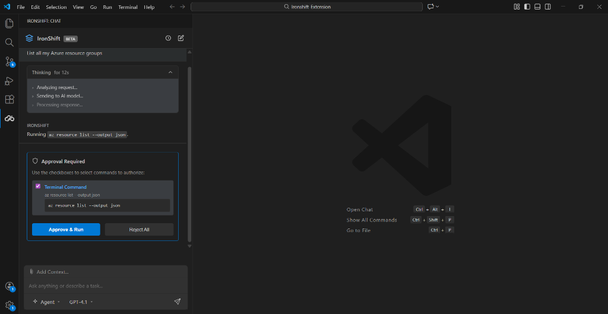

<h1 align="center">IronShift - AI-Powered Cloud Infrastructure Copilot</h1>

<p align="center">
  <strong>Manage Azure & AWS through natural conversation—right inside VS Code</strong>
</p>

<p align="center">
  <a href="https://marketplace.visualstudio.com/items?itemName=IronShift.ironshift">
    
  </a>
  <a href="https://marketplace.visualstudio.com/items?itemName=IronShift.ironshift">
    
  </a>
  <a href="https://marketplace.visualstudio.com/items?itemName=IronShift.ironshift">
    
  </a>
  <a href="https://twitter.com/IronShiftDev">
    
  </a>
  <a href="https://discord.gg/ironshift">
    
  </a>
  <a href="https://linkedin.com/company/ironshift">
    
  </a>
</p>

<p align="center">
  <a href="#what-is-ironshift">What is IronShift</a> •
  <a href="#key-features">Features</a> •
  <a href="#quick-start">Quick Start</a> •
  <a href="#supported-clouds">Clouds</a> •
  <a href="#support">Support</a>
</p>

---

## What is IronShift?

**IronShift** is your AI-powered cloud infrastructure copilot that lives right inside VS Code. Stop context-switching between your IDE, cloud consoles, and documentation.

> Just ask IronShift what you need, and it will manage, troubleshoot, and automate your cloud infrastructure—with your approval.

<p align="center">
  
</p>

---

## Key Features

### Natural Language Interface
Ask questions in plain English. No need to memorize CLI commands or navigate complex cloud consoles.

```
"List all my Azure VMs in the production resource group"
"What's the status of my Kubernetes pods?"
"Show me the logs for my container app"
"Start the VM named web-server-01"
"Create a storage account in West US region"
```

---

### Multi-Cloud Support
Seamlessly manage resources across multiple cloud providers from a single interface.

<p align="center">
  
  
</p>

---

### Three Operation Modes
Choose the right mode for your task:

| Mode | Description |
|------|-------------|
| **Chat** | Quick Q&A and information retrieval |
| **Plan** | Generate step-by-step plans before execution |
| **Agent** | Autonomous execution with approval checkpoints |

---

### Human-in-the-Loop Safety
Every action is reviewed before execution. **You stay in control.**

<p align="center">
  
</p>

IronShift shows you:
- The exact tool/command to be executed
- All parameters and arguments
- Risk assessment for each operation

**Approve, modify, or reject any action before it runs.**

---

### Multiple AI Models
Choose from industry-leading AI models across multiple providers:

| Model | Provider | Best For |
|-------|----------|----------|
| **GPT-4.1** | OpenAI | Complex reasoning & troubleshooting |
| **GPT-4o** | OpenAI | Fast, high-performance responses |
| **Claude Sonnet 4.5** | Anthropic | Detailed analysis & explanations |
| **Claude Sonnet 4** | Anthropic | Balanced performance |
| **Gemini 2.5 Pro** | Google | Advanced reasoning & multimodal tasks |
| **Gemini 2.5 Flash** | Google | Speed-optimized responses |
| **Grok 4** | xAI | Real-time knowledge & creative solutions |

---

### Auto Mode — Intelligent Model Selection
Let IronShift choose the optimal model for each task automatically:

- **Command Generation** — Uses best-in-class models for accurate CLI commands
- **Analysis & Reasoning** — Leverages advanced models for complex troubleshooting
- **Fast Responses** — Switches to speed-optimized models for quick queries
- **Toggle anytime** — Switch between Auto and manual model selection

*No API key management needed—just enable Auto mode and let IronShift handle the rest.*

---

### Image Attachments & Vision
Attach screenshots or diagrams for context-aware assistance:
- **Paste** images directly from clipboard
- **Drag & drop** files into the chat
- **Browse** to select multiple images
- Supports PNG, JPG, GIF, WebP (up to 10MB)

*Great for sharing error screenshots, architecture diagrams, or console outputs.*

---

### Smart Chat Management
- **Persistent History** — All chats saved locally (privacy-first)
- **Multiple Sessions** — Switch between different conversations
- **Edit & Retry** — Modify previous messages and regenerate responses
- **Auto-cleanup** — Empty chats are automatically removed

---

### Real-Time Streaming
Get instant feedback with real-time streaming responses. Watch as IronShift analyzes your request and provides step-by-step results.

---

### Batch Command Execution
Execute multiple commands in sequence with real-time progress tracking. IronShift queues operations and shows live output for each command.

---

### Integrated Terminal Execution
Execute cloud commands directly in VS Code's integrated terminal. See command outputs in real-time without leaving your editor.

---

## Quick Start

### Installation

1. Open **Visual Studio Code**
2. Go to **Extensions** (`Ctrl+Shift+X` / `Cmd+Shift+X`)
3. Search for **"IronShift"**
4. Click **Install**

Or install directly:
```
ext install IronShift.ironshift
```

### Prerequisites

- **VS Code** v1.85.0 or later
- **Azure CLI** (for Azure operations) - [Install Guide](https://docs.microsoft.com/en-us/cli/azure/install-azure-cli)
- **AWS CLI** (for AWS operations) - [Install Guide](https://docs.aws.amazon.com/cli/latest/userguide/getting-started-install.html)

### Getting Started

1. Click the **IronShift** icon in the Activity Bar
2. Authenticate with your cloud provider when prompted
3. Start asking questions in natural language!

---

## Keyboard Shortcuts

| Action | Windows/Linux | Mac |
|--------|---------------|-----|
| Open IronShift | `Ctrl+Shift+P` → "Open IronShift" | `Cmd+Shift+P` → "Open IronShift" |
| Send Message | `Enter` | `Enter` |
| New Line | `Shift+Enter` | `Shift+Enter` |
| Paste Image | `Ctrl+V` | `Cmd+V` |

---

## Supported Clouds & Operations

### Microsoft Azure
| Category | Operations |
|----------|------------|
| **Resource Groups** | List, Create, Delete |
| **Virtual Machines** | List, Start, Stop, Restart, Get Status |
| **Container Apps** | List, Manage, View Logs |
| **Kubernetes (AKS)** | Cluster Management, Pod Status, Deployments |
| **Storage Accounts** | List, Create, Manage Blobs |
| **App Services** | Deploy, Configure, Monitor |
| **Azure Advisor** | Get Recommendations, Cost Optimization |
| **Monitor & Logs** | Query Metrics, Application Insights |

### Amazon AWS
| Category | Operations |
|----------|------------|
| **EC2 Instances** | List, Start, Stop, Terminate, Describe |
| **S3 Buckets** | List, Create, Manage Objects, Permissions |
| **Lambda Functions** | List, Invoke, View Logs, Update Config |
| **ECS/EKS Clusters** | Cluster & Service Management, Task Definitions |
| **IAM Resources** | Users, Roles, Policies, Access Keys |
| **CloudWatch** | Logs, Metrics, Alarms |

---

## Configuration

| Setting | Default | Description |
|---------|---------|-------------|
| `ironshift.backendUrl` | IronShift Cloud | Backend service URL (enterprise deployments) |
| `ironshift.autoApprove` | `false` | Auto-approve low-risk read operations |
| `ironshift.defaultModel` | `Auto` | Default AI model for responses (supports Auto mode) |

---

## Security & Privacy

- **Privacy-First** — Chat history stored locally, never sent to cloud
- **Credentials stay local** — Uses your existing CLI authentication
- **Human-in-the-loop** — All write operations require explicit approval
- **Audit trail** — Every action logged in conversation history
- **Enterprise ready** — Self-host your own backend for complete control
- **No data collection** — Your queries and results stay on your machine

---

## Roadmap

- [ ] Google Cloud Platform (GCP) support
- [ ] Terraform integration for IaC management
- [ ] Cost analysis and optimization suggestions
- [ ] Scheduled operations and automation workflows
- [ ] Team collaboration features
- [ ] Custom tool definitions for enterprise needs

---

## Support, Feedback & Community

- **Bug Reports:** [GitHub Issues](https://github.com/Clavel-AI/IronShift-Assistant/issues)
- **Feature Requests:** [GitHub Discussions](https://github.com/Clavel-AI/IronShift-Assistant/discussions)
- **Email:** support@ironshift.dev
- **Website:** [https://ironshift.dev](https://ironshift.dev)

---

## License

This project is licensed under the MIT License - see the [LICENSE](LICENSE) file for details.

---

<p align="center">
  Made with ❤️ by the <strong>IronShift Team</strong>
</p>

<p align="center">
  <a href="https://marketplace.visualstudio.com/items?itemName=IronShift.ironshift">
    
  </a>
</p>
